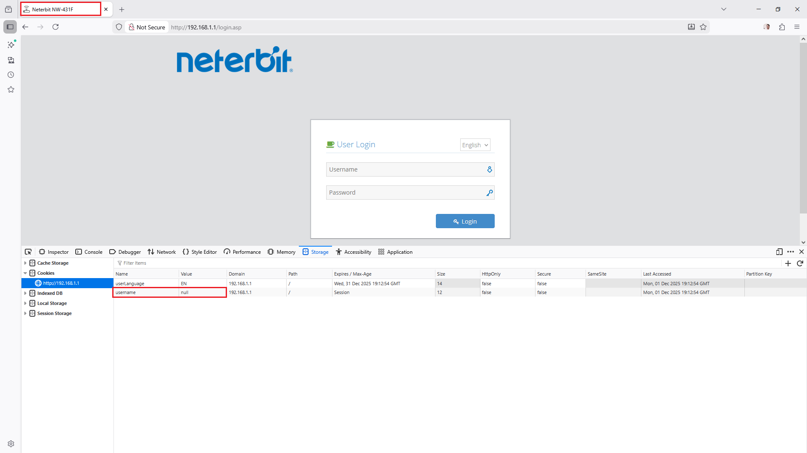
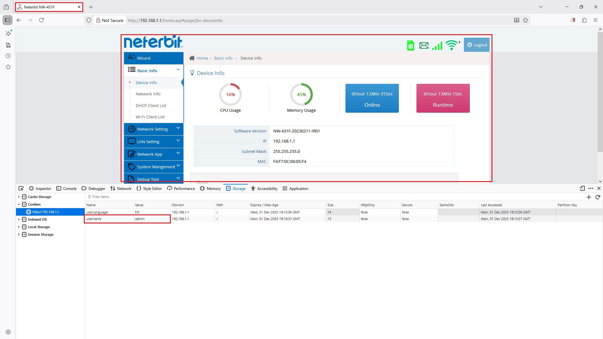

# CVE-2025-67446: Improper Authentication (Authentication Bypass)

## Information
**Description:** Improper Authentication (Authentication Bypass) in Neterbit NW-431F
**Versions Affected:** Neterbit NW-431F Router - Software Version: NW-431F-20241014-IR03 (fixed version isn't available) 
**Researcher:** Ali Abdollahi (https://t.me/the_aliabdollahi @The_AliAbdollahi)  
**NIST CVE Link:** https://nvd.nist.gov/vuln/detail/CVE-2025-67446  

## Proof-of-Concept Exploit
### Description
Improper Authentication (Authentication Bypass) exists in Neterbit
NW-431F Router 20241014-IR03 and before. The router uses a
weak/predictable cookie value for authentication. By modifying the
cookie value (e.g., setting it to "admin"), an attacker can bypass the
authentication schema and gain unauthorized access to admin
functionalities.

### Proof of Concept (PoC):
Unauthorized access to admin privileges by manipulating cookie values:
1- open login page (https://192.168.1.1/login.asp)
2- Change the "username" cookie value to "admin".
3- send request to root (https://192.168.1.1/) page or send the modified cookie in a new request.
4- Observe that the application grants admin privileges without proper authentication.

### Screenshot

