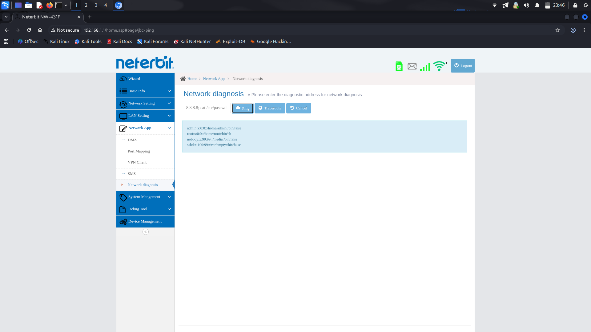

# CVE-2025-67447: OS Command Injection

## Information
* **Description:** OS Command Injection in Neterbit NW-431F
* **Versions Affected:** Neterbit NW-431F Router - Software Version: NW-431F-20241014-IR03 (fixed version isn't available) 
* **Researcher:** Ali Abdollahi (https://t.me/the_aliabdollahi @The_AliAbdollahi)  
* **NIST CVE Link:** https://nvd.nist.gov/vuln/detail/CVE-2025-67447  

## Proof-of-Concept Exploit
### Description
The network diagnosis (ping) module in Neterbit NW-431F Router
20241014-IR03 and before is vulnerable to OS command injection. The
application does not properly sanitize user input in the IP address
field before passing it to the system's ping command. An attacker can
inject arbitrary OS commands, which will be executed with the
privileges of the web server.

### Proof of Concept (PoC):
1. Navigate to the network diagnosis (ping) module.
2. In the IP address field, enter a payload such as:
`8.8.8.8; ls`
or
`8.8.8.8; cat /etc/passwd`

3. Submit the form.
4. Observe that the output includes the result of the injected command (e.g., the output of ls or the contents of /etc/passwd).

### Screenshot

