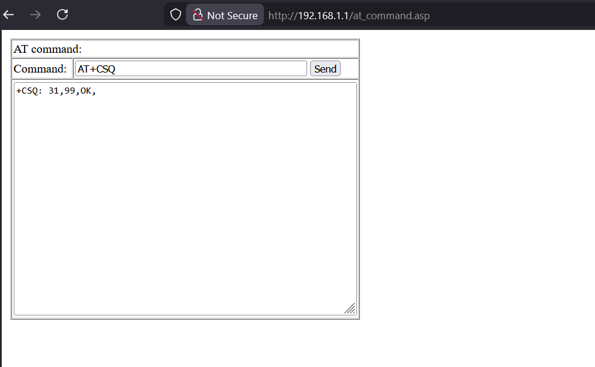
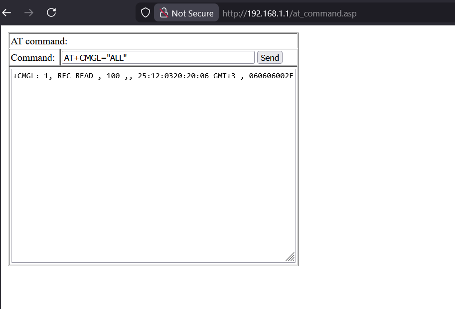

# CVE-2025-69755: unauthorized access to sensitive functionality

## Information
* **Description:** unauthorized access to sensitive functionality in Neterbit NW-431F
* **Versions Affected:** Neterbit NW-431F Router - Software Version: NW-431F-20241014-IR03 (fixed version isn't available) 
* **Researcher:** Ali Abdollahi (https://t.me/the_aliabdollahi @The_AliAbdollahi)  
* **NIST CVE Link:** https://nvd.nist.gov/vuln/detail/CVE-2025-69755  

## Proof-of-Concept Exploit
### Description
An issue in Neterbit NW-431F Router vNW-431F-20241014-IR03 allows a
remote attacker to obtain sensitive information and execute arbitrary
code via a crafted command to the at_command.asp interface

### Proof of Concept (PoC):
An attacker can send AT commands directly to the device via webpage (at_command.asp) interface.
1. go to http://192.168.1.1/at_command.asp page.
2. type and send AT command like:
`AT+CMGL="ALL"`

3. Observe that the application execute commands (like read SMS messages) without proper authentication or authorization.

### Screenshot

